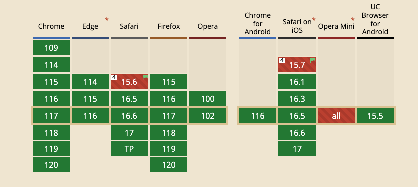

最近在做网页聊天挂件时，挂件里的消息滚动在最顶部或者最底部时整个网页就是跟随滚动，体验非常不好。
下面给一个GIF的例子

可以看出当滚动到底部时，容器发生了滚动。有时我们希望容器不发生滚动。

css中的`overscroll-behavior`属性可以达到该目的。

## overscroll-behavior 介绍
`overscroll-behavior`可以用来控制浏览器过度滚动的表现，就是滚动到边界时的表现。
默认情况下当触及到顶部或底部时，元素的祖先元素元素就会发生滚动，这种行为被称为“滚动链”。移动端浏览器倾向于提供一种“触底”效果，甚至进行页面刷新。

`overscroll-behavior`包含的值：
+ auto： 默认效果，滚动到边界时触发容器的滚动。
+ contain: 默认的滚动边界不变（触底和刷新效果），但是临近的滚动区域不会受到滚动连的影响。
+ none: 临近区域不会受到滚动链的影响，同时默认的滚动到边界的表现也被阻止。

下面是设置为`contain`的效果：

滚动到顶部或底部是容器没有发生滚动。
demo地址

## 兼容性

目前主流的浏览器都支持，在项目中可以放心使用，即使浏览器不支持该属性，也不会影响正常使用，只是体验受到影响。

