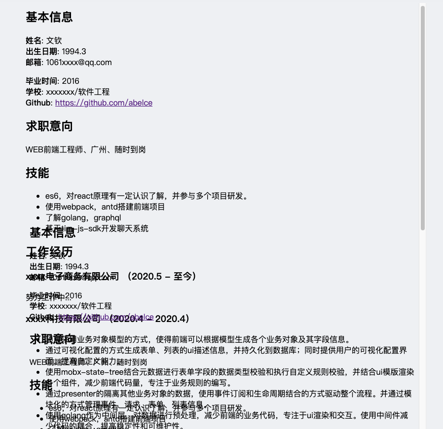

在业务开发过程中，有时需要使用iframe，比如通过iframe来模拟页面，或者隔离样式。

## 渲染iframe
下面的方式使用iframe是不生效的
```tsx
<iframe>
    <div></div>
</iframe>
```
因为iframe就相当于一个新的页面，所以要把组件添加渲染到iframe内部的dom上才有效果。
所以通过`srcDoc`设置iframe的初始html，iframe挂在后再把子组件动态挂载到`iframe-root`节点即可。

```ts
   <iframe
      srcDoc={`
      <!DOCTYPE html>
      <html>
        <meta charset="UTF-8">
        <head>
        </head>
        <body><div id="iframe-root"></div></body>
      </html>
      `}
    >
    </iframe>
```

当iframe挂载完成（就是`onload`事件调用后），使用`createPortal`将组件插入到iframe内部，代码如下：

``` ts
// 省略后的代码
const target = doc.querySelector(mountSelector || "#iframe-root");
if (!target) {
    return null;
}
return createPortal(typeof children === "function" ? children() : children, target);
```
上面将子组件渲染到了iframe中，但是会发现样式没有起作用，没起作用就对了，因为样式在站点加载了，但是iframe中没有加载样式。

## 样式处理
通常样式打包完成后时直接挂在站点的html上的，iframe拿不到样式，页面就会错乱。比如下面的简历模版


可以看到，布局发生了错乱。

那么就需要将样式添加到iframe中，方式很多，比如如下几种：
1. 将站点的`head`标签的内容全部插入到iframe的`head`，，这种最简单
2. 将站点的`head`标签的内的`style`以及`link`中的样式全部插入到iframe中，相比第一种插入的内容会少很多
3. 打包的时候将要插入的组件的样式分离出来，打包成字符串或者单独的css文件，渲染时插入到iframe的`head`中，推荐该方式。

## 代码实现
直接上代码

MyIframe组件代码

```tsx
// MyIframe
import {
  forwardRef,
  memo,
  useCallback,
  useEffect,
  useMemo,
  useRef,
  useState,
} from "react";
import { createPortal } from "react-dom";

export default memo(
  forwardRef<HTMLIFrameElement, any>(
    (props, forwardRef): JSX.Element => {
      const {
        srcDoc,
        mountSelector,
        children,
        title = "",
        ...resetComplete
      } = props;
      const _frameRef = useRef<HTMLIFrameElement>(null);
      const [loaded, setLoaded] = useState(false);

      const iframeSrcDoc = useMemo(() => {
        return (
          srcDoc ||
          `
          <!DOCTYPE html>
          <html>
            <meta charset="UTF-8">
            <head>
            </head>
            <body><div id="iframe-root"></div></body>
          </html>
        `
        );
      }, [srcDoc]);

      useEffect(() => {
        if (forwardRef) {
          if (typeof forwardRef === "function") {
            forwardRef(_frameRef.current);
          } else {
            forwardRef.current = _frameRef.current;
          }
        }
      }, [forwardRef]);

      const getDocument = useCallback(() => {
        return _frameRef.current?.contentWindow?.document || null;
      }, []);

      const onLoad = useCallback(() => {
        if (!loaded) {
          props.onLoad?.(getDocument());
          setLoaded(true);
        }
      }, [getDocument, loaded, props]);

      const renderContent = useCallback(() => {
        const doc = getDocument();
        if (!doc) {
          return null;
        }
        const target = doc.querySelector(mountSelector || "#iframe-root");
        if (!target) {
          return null;
        }
        return createPortal(
          typeof children === "function" ? children(doc) : children,
          target
        );
      }, [getDocument, children, mountSelector]);

      return (
        <iframe
          {...resetComplete}
          title={title}
          srcDoc={iframeSrcDoc}
          ref={_frameRef}
          onLoad={onLoad}
        >
          {loaded && renderContent()}
        </iframe>
      );
    }
  )
);
```
使用MyIFrame

```tsx
const IframePreview = (props) => {

    const onLoad = (doc) => {
        // iframe unload事件
        // 可以处理样式等操作
    }
    return (
        <MyIframe
        // srcDoc 设置iframe初始内容
        srcDoc={`
        <!DOCTYPE html>
        <html>
            <meta charset="UTF-8">
            <head>
            </head>
            <body><div id="iframe-root"></div></body>
        </html>
        `}
        onLoad={onLoad}
        >
        {(doc) => <div>content</div>}
        </MyIframe>
    );
};
```
上面的代码可以直接运行。

## 总结
一个iframe的使用主要分为如下两步：
1. 使用iframe
2. iframe的onload执行后，将内容渲染到iframe中，同时添加样式

我的简历模版就是使用的iframe来实现，如有兴趣可以看看 [模版中心](https://cv.vwood.xyz/themes)
   
